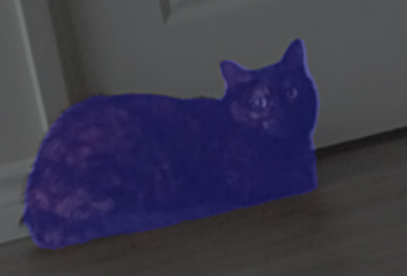

<!-- PROJECT SHIELDS -->
<!--
*** I'm using markdown "reference style" links for readability.
*** Reference links are enclosed in brackets [ ] instead of parentheses ( ).
*** See the bottom of this document for the declaration of the reference variables
*** for contributors-url, forks-url, etc. This is an optional, concise syntax you may use.
*** https://www.markdownguide.org/basic-syntax/#reference-style-links
-->
[![Contributors][contributors-shield]][contributors-url]
[![Forks][forks-shield]][forks-url]
[![Stargazers][stars-shield]][stars-url]
[![Issues][issues-shield]][issues-url]
[![MIT License][license-shield]][license-url]
[![LinkedIn][linkedin-shield]][linkedin-url]


<!-- PROJECT LOGO -->
<br />
<p align="center">
  <a href="https://github.com/sam-morales/semantic-segmentation/">
    
  </a>

  <h3 align="center">Semantic Segmentation Notebook</h3>

  <p align="center">
    An exploration into semantic segmentation tools using machine learning. The available script uses OpenCV to capture images using a webcam and then detect objects in the captured image. Additionally, the Jupyter Notebook takes a deeper dive into the code to look at the process flow for utilizing available models on various objects.
    <br />
    <br />
    <a href="https://colab.research.google.com/drive/1dPU-b7ISLplrhSSTcY6jrxpo7xWnfV_E?usp=sharing">View Demo</a>
    ·
    <a href="https://github.com/github_username/repo_name/issues">Report Bug</a>
    ·
    <a href="https://github.com/github_username/repo_name/issues">Request Feature</a>
  </p>
</p>


<!-- TABLE OF CONTENTS -->
## Table of Contents

* [About the Project](#about-the-project)
  * [Built With](#built-with)
* [Getting Started](#getting-started)
  * [Prerequisites](#prerequisites)
  * [Installation](#installation)
* [Usage](#usage)
* [Roadmap](#roadmap)
* [Contributing](#contributing)
* [License](#license)
* [Contact](#contact)
* [Acknowledgements](#acknowledgements)


<!-- ABOUT THE PROJECT -->
## About The Project

The inspiration for the mini-project came from Tesla's work on their Autopilot AI. The use of semantic segmentation to detect objects around the vehicle and avoid them inspired me to learn more about this technology and how it works.

All computer vision problems begin with pixels. The question at hand is: is it possible to group pixels together and classify them as specific things? This would enable a machine vision system to more accurately determine information in an image by only considering specific things present in it.

In this project, semantic segmentation is used which just means that objects classified with the same pixel values are given the same colourmaps. This differs from instance segmentation where objects with the same classification are also given differing colourmaps. 

This particular model has 20 different object categories:


### Built With

* [Pixellib]()
* [Tensorflow]()
* [OpenCV]()
* [Jupyter Lab]()


<!-- GETTING STARTED -->
## Getting Started

To get a local copy up and running follow these simple steps.

### Prerequisites

You will need the following libraries to run the segment.py code locally. For the Jupyter Notebook just follow the Colab link!
* Tensorflow
```sh
pip3 install tensorflow
```
* OpenCV
```sh
pip3 install opencv-python
```
* scikit-image
```sh
pip3 install scikit-image
```
* Pillow
```sh
pip3 install pillow
```
* Pixellib
```sh
pip3 install pixellib
```
* Keyboard
```sh
pip3 install keyboard
```
### Installation

Just clone the repo!


## Usage

For using the segment.py script, presseing c will capture an image while q will quit the program. 
Just right click on the generated overlay to save!

The Jupyter Notebook can be accessed [here](https://colab.research.google.com/drive/1dPU-b7ISLplrhSSTcY6jrxpo7xWnfV_E?usp=sharing)


<!-- ROADMAP -->
## Roadmap

In the future more research will be done on instance segmentation and a notebook will be added on this topic as well


<!-- CONTRIBUTING -->
## Contributing

Contributions are what make the open source community such an amazing place to be learn, inspire, and create. Any contributions you make are **greatly appreciated**.

1. Fork the Project
2. Create your Feature Branch (`git checkout -b feature/AmazingFeature`)
3. Commit your Changes (`git commit -m 'Add some AmazingFeature'`)
4. Push to the Branch (`git push origin feature/AmazingFeature`)
5. Open a Pull Request


<!-- LICENSE -->
## License

Distributed under the MIT License. See `LICENSE` for more information.


<!-- CONTACT -->
## Contact

Your Name - [@twitter_handle](https://twitter.com/twitter_handle) - email

Project Link: [https://github.com/github_username/repo_name](https://github.com/github_username/repo_name)


<!-- ACKNOWLEDGEMENTS -->
## Acknowledgements

* []()
* []()
* []()


<!-- MARKDOWN LINKS & IMAGES -->
<!-- https://www.markdownguide.org/basic-syntax/#reference-style-links -->
[contributors-shield]: https://img.shields.io/github/contributors/github_username/repo.svg?style=flat-square
[contributors-url]: https://github.com/github_username/repo/graphs/contributors
[forks-shield]: https://img.shields.io/github/forks/github_username/repo.svg?style=flat-square
[forks-url]: https://github.com/github_username/repo/network/members
[stars-shield]: https://img.shields.io/github/stars/github_username/repo.svg?style=flat-square
[stars-url]: https://github.com/github_username/repo/stargazers
[issues-shield]: https://img.shields.io/github/issues/github_username/repo.svg?style=flat-square
[issues-url]: https://github.com/github_username/repo/issues
[license-shield]: https://img.shields.io/github/license/github_username/repo.svg?style=flat-square
[license-url]: https://github.com/github_username/repo/blob/master/LICENSE.txt
[linkedin-shield]: https://img.shields.io/badge/-LinkedIn-black.svg?style=flat-square&logo=linkedin&colorB=555
[linkedin-url]: https://linkedin.com/in/github_username
[product-screenshot]: images/screenshot.png
